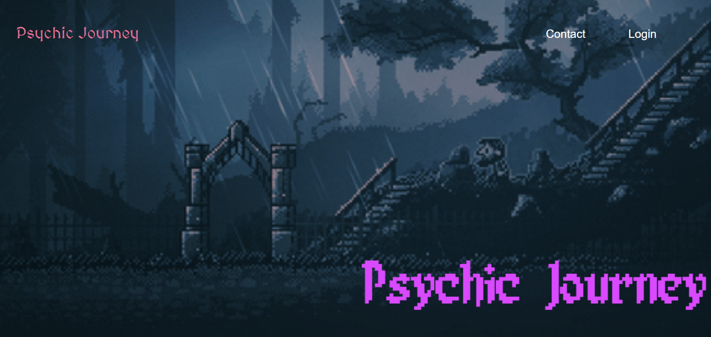
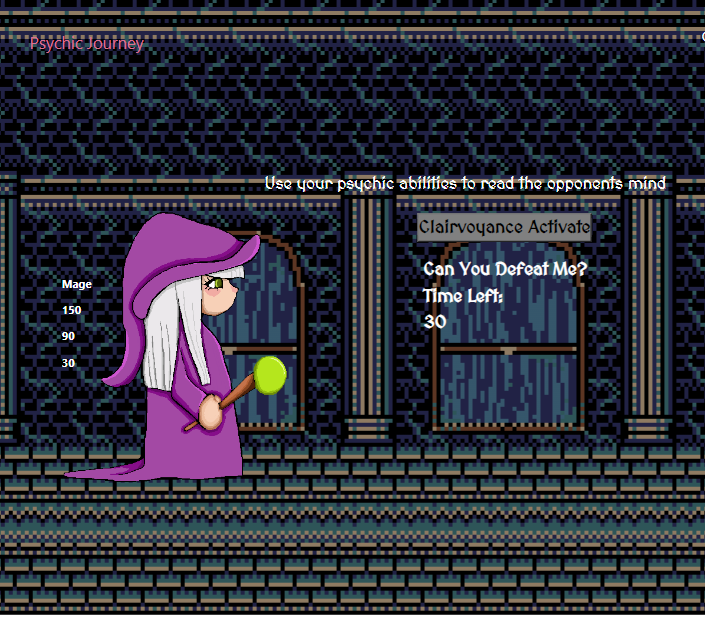

# Psychic-Journey

## Description

The motivation for this project was to create a playable game with many of the concepts learned in the course. 
It was also to learn how to cycle through the view of a client with handlebars, create a back-end server, and seed tables with SQL. 

## Installation

The following is a step by step instruction on how to download the source code of the project and develop with it:

- Head to https://github.com/NathanKryz/psychic-journey and git clone the htttps link
- Create a .env file and add your personal mysql information to it
- Open git bash terminal and install all packages used but typing 'npm i'
- Then in git bash terminal open mysql and create the database
- Then in git bash terminal seed the data by typing 'npm run seed'
- Finally to run the localhost type 'npm start'

## Usage

To use this application:

- Login to user account, if you have no account please register
- Once logged in click start game
- Choose the character you want to play with
- Once in the game room, click 'activate clairvoyance' to start the game
- Type letters in your keyboard trying to guess the word
- If you guess the word correctly your character will attack the opponent, if not the opponent will attack your character
- If your opponents hitpoints hit 0 you move on your the next round
- If your hitpoints hit zero you lose the game

## License 

MIT License

## Link 

The following is the link to the deployed application on Heroku:

https://psychic-journey.herokuapp.com/

